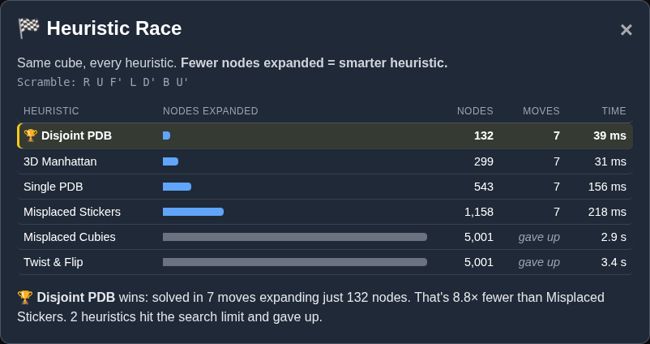

<p align="center">
  
</p>

<p align="center">
  🇬🇧 <b>English</b> · 🇮🇹 <a href="README.it.md">Italiano</a>
</p>

<p align="center">
  <a href="https://sangelastro.github.io/a-star-is-born/"><b>▶️ Try the live demo</b></a>, no install needed
</p>

> **A love story between a search algorithm and a scrambled Rubik's Cube.**
> One is lost, twisted and confused. The other is a pathfinder with a heuristic and a plan.
> Spoiler: it ends with every face the same color. 🌟

**A\* Is Born** is an interactive 3D playground where you scramble a Rubik's Cube and watch the A\* algorithm solve it, one decision at a time. You can see every node it expands, every candidate it considers and *why* it picked the one it did. Think of it as a director's cut of a search algorithm.

<p align="center">
  
</p>

## ✨ Features

- 🏁 **Heuristic Race**: one click and every heuristic solves the same cube, then a leaderboard shows nodes expanded, solution length and time.
- 🧊 **3D cube** rendered with Three.js: orbit, zoom and admire it from every angle.
- 👣 **Step-by-step A\***: advance one expansion at a time, or hit *Auto Play* and grab popcorn.
- 🌳 **Live search tree** built with D3. The current node, the frontier and the winning path are highlighted, and you can zoom, pan or go full screen.
- 📋 **Open set inspector** showing the best candidates and their `F = G + H` scores.
- 💬 **"Why?" panel** explaining every choice in plain English.
- 🧠 **A heuristic that is a language model**: [OpenJev](docs/openjev.md) reads plain-English facts about the cube and judges how solved it looks. The "Why?" panel shows exactly what it read and how it judged every node (needs a small local server).
- 📖 **Solve by the manual**: OpenJev solves a fully scrambled cube by following the beginner's layer-by-layer method, choosing one algorithm at a time; the "Why?" panel shows every option it weighed. [How it works →](docs/openjev.md#-solve-by-the-manual)
- 🎲 **Scramble it your way**:
  - random scrambles by difficulty, starting from a solved cube or stacked on the current one;
  - a custom move sequence like `U R' F D`;
  - manual color mode, where you paint the stickers directly on the cube.
- 🕹️ **Solution history** with replay, plus CSV export of scrambles and solutions.

## 🧠 A\* in 60 seconds

A\* is a best-first search algorithm. It finds a path from a start state (the scrambled cube) to a goal state (the solved cube) by always exploring the most *promising* state first.

For every state `n`, A\* computes:

```
f(n) = g(n) + h(n)
```

| Term | Meaning | On the cube |
|---|---|---|
| `g(n)` | Actual cost from the start to `n` | Moves already made |
| `h(n)` | **Heuristic**: estimated cost from `n` to the goal | Educated guess of moves still needed |
| `f(n)` | Estimated total cost of the best path through `n` | What A\* uses to choose |

The loop:

1. Put the start state in the **open set** (the candidates to explore).
2. Pick the state with the **lowest `f`**. If it is the goal, you're done 🎉
3. Otherwise **expand** it: generate all 12 neighboring states (`U U' D D' L L' R R' F F' B B'`), compute their `f` and add them to the open set.
4. Move the expanded state to the **closed set**, so it is never explored twice, and repeat.

**Why the heuristic matters.** If `h` never overestimates the real distance (an *admissible* heuristic), A\* is guaranteed to find a shortest solution. The closer `h` is to the truth, the fewer states A\* has to explore. That's why the app lets you switch heuristics and compare: a weak heuristic wanders around, a strong one walks straight home.

> ℹ️ Some heuristics in this demo are scaled for speed and are not strictly admissible, so solutions are short but not always guaranteed to be optimal. The search is also capped at 5,000 iterations to keep the browser happy.

## 🏁 The Heuristic Race

Talk is cheap, so let them race. Scramble the cube, hit **🏁 Race all heuristics** and every heuristic solves the *same* cube, one after another. The leaderboard ranks them by **nodes expanded**, the honest measure of how smart a heuristic is: the fewer states A\* has to explore, the better its guess of the distance to the goal.

<p align="center">
  
</p>

On this 7-move scramble, the disjoint pattern database finds the solution after expanding **132 nodes**, while counting misplaced stickers needs **1,158**. Two heuristics never get there before the search limit. Same algorithm, same cube: the only difference is the heuristic. That's A\* in a nutshell.

> The PDB tables are built automatically the first time you start a race (a few seconds, once per session).

## 🧩 Heuristics

| Heuristic | Idea |
|---|---|
| Misplaced Stickers | Counts stickers that are not on their correct face. |
| Misplaced Cubies | Counts corners and edges that are out of their home position. |
| Twist & Flip | Counts corners that are twisted and edges that are flipped. |
| 3D Manhattan Distance | Adds up how far each sticker is from its home face. |
| Single PDB (Corners) | Pattern databases for corner orientation and permutation, built in the browser with a breadth-first search. |
| Disjoint PDB (Corners + Edges) | Combines the corner PDBs with a PDB for a subset of edges. |
| 🧠 OpenJev language model | No formula: an NLI model reads facts about the cube (solved cubies, complete faces, stickers at home) and judges three statements, from *"at least half of the cubies are solved"* to *"the cube is solved"*. `h = 10 × (1 − average agreement)`. **[How it works →](docs/openjev.md)** |

> The PDB heuristics need a click on **Generate PDBs** first. The tables are built in your browser and take a few seconds.
>
> The OpenJev heuristic needs its model server running on your machine (`python openjev/server.py`, see [Run it locally](docs/openjev.md#run-it-locally)). Without it, the option tells you how to start it and the race skips it.

## 🚀 Getting started

The quickest way is the [live demo](https://sangelastro.github.io/a-star-is-born/). To run it locally you need [Node.js](https://nodejs.org/) 18+.

```bash
npm install
npm run dev
```

Then open the URL printed by Vite (usually http://localhost:5173).

To build a static bundle:

```bash
npm run build
npm run preview
```

Every push to `main` is deployed to GitHub Pages automatically by the workflow in `.github/workflows/deploy.yml`.

## 🗂️ Project structure

```
index.html      UI layout
main.js         Three.js scene, UI wiring, D3 search tree
cube.js         3D cube meshes and sticker rendering
cubeLogic.js    Cube state, moves and cubie (permutation/orientation) model
solver.js       Heuristics and the A* generator
src/pdb.js      Pattern database indexing and generation
src/openjev.js  OpenJev heuristic: cube facts, local model client, verdicts for the "Why?" panel
src/manual.js   Layer-by-layer manual: stages, algorithms, options and the OpenJev chooser
openjev/        Local OpenJev scoring server (Python) and model download script
bench/race.mjs  Headless Heuristic Race in Node, on seeded scrambles
bench/manual*.mjs  Manual solver: OpenJev on random cubes, and sanity tests without a model
style.css       Styles
```

## 🔤 Notation

Moves use standard Singmaster notation: `U` (up), `D` (down), `L` (left), `R` (right), `F` (front), `B` (back). A trailing `'` means a counter-clockwise turn.

## 🏆 Credits

**The algorithm.** The real stars of the show:

- **A\*** was introduced by **Peter E. Hart, Nils J. Nilsson and Bertram Raphael** at the Stanford Research Institute:
  *"A Formal Basis for the Heuristic Determination of Minimum Cost Paths"*, IEEE Transactions on Systems Science and Cybernetics, 4(2), 100–107, 1968.
- **Pattern databases** were introduced by **Joseph C. Culberson and Jonathan Schaeffer**:
  *"Pattern Databases"*, Computational Intelligence, 14(3), 318–334, 1998.
- **Pattern databases applied to the Rubik's Cube** come from **Richard E. Korf**:
  *"Finding Optimal Solutions to Rubik's Cube Using Pattern Databases"*, AAAI-97, 1997.
- **Disjoint pattern databases** are by **Richard E. Korf and Ariel Felner**:
  *"Disjoint Pattern Database Heuristics"*, Artificial Intelligence, 134(1–2), 9–22, 2002.

**The language model.** [OpenJev](https://huggingface.co/AlexWortega/openjev) by AlexWortega (MIT), built on Qwen3.5 by Alibaba.

**The puzzle.** The Rubik's Cube was invented by **Ernő Rubik** in 1974.

**Built with** [Three.js](https://threejs.org/) · [D3.js](https://d3js.org/) · [Vite](https://vitejs.dev/)

## 📄 License

[MIT](LICENSE)

<sub>Rubik's Cube® is a registered trademark of Spin Master Ltd. This is an independent educational project, not affiliated with or endorsed by the trademark owner.</sub>
