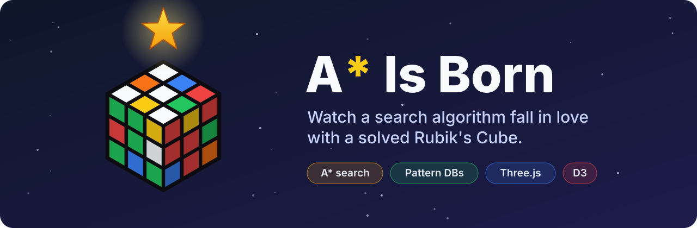
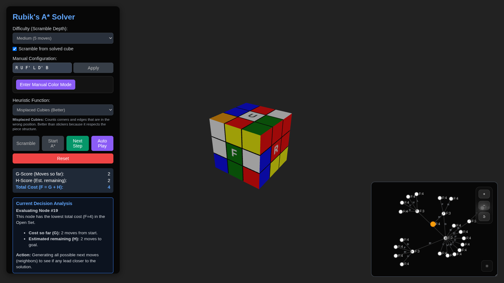

<p align="center">
  
</p>

<p align="center">
  🇬🇧 <b>English</b> · 🇮🇹 <a href="README.it.md">Italiano</a>
</p>

> **A love story between a search algorithm and a scrambled Rubik's Cube.**
> One is lost, twisted and confused. The other is a pathfinder with a heuristic and a plan.
> Spoiler: it ends with every face the same color. 🌟

**A\* Is Born** is an interactive 3D playground where you scramble a Rubik's Cube and watch the A\* algorithm solve it, one decision at a time. You can see every node it expands, every candidate it considers and *why* it picked the one it did. Think of it as a director's cut of a search algorithm.

<p align="center">
  
</p>

## ✨ Features

- 🧊 **3D cube** rendered with Three.js: orbit, zoom and admire it from every angle.
- 👣 **Step-by-step A\***: advance one expansion at a time, or hit *Auto Play* and grab popcorn.
- 🌳 **Live search tree** built with D3. The current node, the frontier and the winning path are highlighted, and you can zoom, pan or go full screen.
- 📋 **Open set inspector** showing the best candidates and their `F = G + H` scores.
- 💬 **"Why?" panel** explaining every choice in plain English.
- 🎲 **Scramble it your way**:
  - random scrambles by difficulty, starting from a solved cube or stacked on the current one;
  - a custom move sequence like `U R' F D`;
  - manual color mode, where you paint the stickers directly on the cube.
- 🕹️ **Solution history** with replay, plus CSV export of scrambles and solutions.

## 🧠 A\* in 60 seconds

A\* is a best-first search algorithm. It finds a path from a start state (the scrambled cube) to a goal state (the solved cube) by always exploring the most *promising* state first.

For every state `n`, A\* computes:

```
f(n) = g(n) + h(n)
```

| Term | Meaning | On the cube |
|---|---|---|
| `g(n)` | Actual cost from the start to `n` | Moves already made |
| `h(n)` | **Heuristic**: estimated cost from `n` to the goal | Educated guess of moves still needed |
| `f(n)` | Estimated total cost of the best path through `n` | What A\* uses to choose |

The loop:

1. Put the start state in the **open set** (the candidates to explore).
2. Pick the state with the **lowest `f`**. If it is the goal, you're done 🎉
3. Otherwise **expand** it: generate all 12 neighboring states (`U U' D D' L L' R R' F F' B B'`), compute their `f` and add them to the open set.
4. Move the expanded state to the **closed set**, so it is never explored twice, and repeat.

**Why the heuristic matters.** If `h` never overestimates the real distance (an *admissible* heuristic), A\* is guaranteed to find a shortest solution. The closer `h` is to the truth, the fewer states A\* has to explore. That's why the app lets you switch heuristics and compare: a weak heuristic wanders around, a strong one walks straight home.

> ℹ️ Some heuristics in this demo are scaled for speed and are not strictly admissible, so solutions are short but not always guaranteed to be optimal. The search is also capped at 5,000 iterations to keep the browser happy.

## 🧩 Heuristics

| Heuristic | Idea |
|---|---|
| Misplaced Stickers | Counts stickers that are not on their correct face. |
| Misplaced Cubies | Counts corners and edges that are out of their home position. |
| Twist & Flip | Counts corners that are twisted and edges that are flipped. |
| 3D Manhattan Distance | Adds up how far each sticker is from its home face. |
| Single PDB (Corners) | Pattern databases for corner orientation and permutation, built in the browser with a breadth-first search. |
| Disjoint PDB (Corners + Edges) | Combines the corner PDBs with a PDB for a subset of edges. |

> The PDB heuristics need a click on **Generate PDBs** first. The tables are built in your browser and take a few seconds.

## 🚀 Getting started

Requires [Node.js](https://nodejs.org/) 18+.

```bash
npm install
npm run dev
```

Then open the URL printed by Vite (usually http://localhost:5173).

To build a static bundle:

```bash
npm run build
npm run preview
```

## 🗂️ Project structure

```
index.html      UI layout
main.js         Three.js scene, UI wiring, D3 search tree
cube.js         3D cube meshes and sticker rendering
cubeLogic.js    Cube state, moves and cubie (permutation/orientation) model
solver.js       Heuristics and the A* generator
src/pdb.js      Pattern database indexing and generation
style.css       Styles
```

## 🔤 Notation

Moves use standard Singmaster notation: `U` (up), `D` (down), `L` (left), `R` (right), `F` (front), `B` (back). A trailing `'` means a counter-clockwise turn.

## 🏆 Credits

**The algorithm.** The real stars of the show:

- **A\*** was introduced by **Peter E. Hart, Nils J. Nilsson and Bertram Raphael** at the Stanford Research Institute:
  *"A Formal Basis for the Heuristic Determination of Minimum Cost Paths"*, IEEE Transactions on Systems Science and Cybernetics, 4(2), 100–107, 1968.
- **Pattern databases** were introduced by **Joseph C. Culberson and Jonathan Schaeffer**:
  *"Pattern Databases"*, Computational Intelligence, 14(3), 318–334, 1998.
- **Pattern databases applied to the Rubik's Cube** come from **Richard E. Korf**:
  *"Finding Optimal Solutions to Rubik's Cube Using Pattern Databases"*, AAAI-97, 1997.
- **Disjoint pattern databases** are by **Richard E. Korf and Ariel Felner**:
  *"Disjoint Pattern Database Heuristics"*, Artificial Intelligence, 134(1–2), 9–22, 2002.

**The puzzle.** The Rubik's Cube was invented by **Ernő Rubik** in 1974.

**Built with** [Three.js](https://threejs.org/) · [D3.js](https://d3js.org/) · [Vite](https://vitejs.dev/)

## 📄 License

[MIT](LICENSE)

<sub>Rubik's Cube® is a registered trademark of Spin Master Ltd. This is an independent educational project, not affiliated with or endorsed by the trademark owner.</sub>
