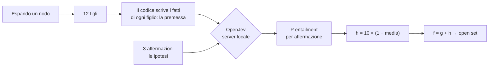
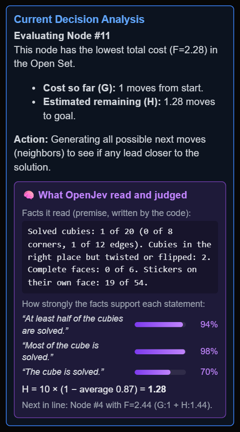
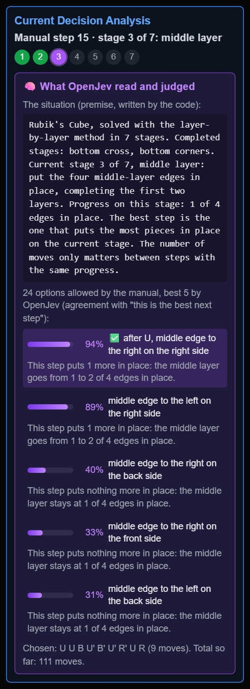

# 🧠 L'euristica OpenJev

🇬🇧 [English](openjev.md) · 🇮🇹 **Italiano** · [← README](../README.it.md)

> **Un'euristica che non sa niente del cubo di Rubik.** Tutte le altre euristiche dell'app sono formule scritte
> da una persona. Questa chiede a un piccolo modello linguistico di *leggere* il cubo e dire quanto sembra risolto.

[OpenJev](https://huggingface.co/AlexWortega/openjev) è un modello NLI (*Natural Language Inference*) da 0,8
miliardi di parametri, costruito su Qwen3.5. Gli si danno una **premessa** e un'**ipotesi** e risponde con tre
probabilità: contraddizione, implicazione (*entailment*), neutro. Non genera testo e non ha mai visto un cubo
durante l'addestramento. È lo stesso modello di [JevMate](https://github.com/sangelastro/JevMate), dove sceglie le
mosse a scacchi.

## Come si inserisce in A\*

A\* ha bisogno di `h(n)`, la stima delle mosse che mancano. Con OpenJev, `h` viene dal giudizio del modello:



1. **Il codice descrive il cubo.** Solo fatti, mai opinioni:
   > Solved cubies: 7 of 20 (2 of 8 corners, 5 of 12 edges). Cubies in the right place but twisted or flipped: 1.
   > Complete faces: 0 of 6. Stickers on their own face: 34 of 54.
2. **OpenJev giudica tre affermazioni**, una piccola scala dalla più facile alla più difficile:
   - *"At least half of the cubies are solved."* (almeno metà dei cubetti è risolta)
   - *"Most of the cube is solved."* (la maggior parte del cubo è risolta)
   - *"The cube is solved."* (il cubo è risolto)
3. **`h = 10 × (1 − media dell'entailment)`**: più i fatti sostengono le affermazioni, più il cubo sembra vicino
   alla soluzione e più `h` è basso. Un cubo risolto ha `h = 0`.

I 12 figli di un nodo vengono valutati con **una sola chiamata** al server locale (12 × 3 = 36 coppie
premessa/ipotesi).

### Perché proprio queste tre affermazioni

Sono state scelte misurando, non a gusto: su 70 cubi mescolati da 1 a 8 mosse, ogni formulazione candidata è
stata confrontata con la vera profondità della mescolata (correlazione di Spearman, più vicina a −1 è meglio).

| Affermazione | Correlazione con la profondità |
|---|---|
| "At least half of the cubies are solved." | **−0,71** |
| "Most of the cube is solved." | **−0,62** |
| "The cube is solved." | **−0,40** |
| "The cube is close to being solved." | +0,56 (direzione sbagliata) |
| "The cube is nearly solved." | −0,01 (piatta) |
| "The cube needs only a few more moves to be solved." | +0,31 (direzione sbagliata) |

Le formulazioni vaghe restano piatte: il modello ha bisogno di un'affermazione che possa confrontare con i fatti.

> **I fatti descrivono, non giudicano mai.** Una prima versione aggiungeva alla premessa riassunti come "la maggior
> parte dei cubetti è fuori posto". Il modello li copiava e ignorava i numeri. Giudicare è compito del modello;
> il codice riporta solo cosa c'è.

## Vedere cosa ha deciso: il pannello "Why?"

Quando l'euristica attiva è OpenJev, il pannello **Current Decision Analysis** mostra, per ogni nodo che A\*
espande, cosa ha letto il modello e come l'ha giudicato:

<p align="center">
  
</p>

L'esempio mostra anche, onestamente, il limite principale del modello: con **1 cubetto risolto su 20** è comunque
d'accordo al 94% con *"almeno metà dei cubetti è risolta"*. Un modello da 0,8B legge male i numeri. Quasi tutto il
segnale utile arriva dalla terza affermazione, che varia più o meno tra 0,35 e 0,75.

## Risultati

`node bench/race.mjs 5 3 150`: gli stessi 5 cubi riproducibili, mescolati con 3 mosse, per ogni euristica
(portatile, RTX 3060).

| Euristica | Risolti | Nodi espansi medi | Soluzione media | Tempo medio |
|---|---|---|---|---|
| 3D Manhattan | 5/5 | 4 | 3,0 | < 1 ms |
| Single PDB / Disjoint PDB | 5/5 | 4 | 3,0 | 1 ms |
| Misplaced Stickers | 5/5 | 5 | 3,0 | < 1 ms |
| Misplaced Cubies | 5/5 | 11 | 3,0 | 2 ms |
| **🧠 OpenJev** | **5/5** | **18** | **3,0 (ottima)** | **13 s** |
| Twist & Flip | 4/5 | 116 | 3,0 | 17 ms |

Un modello che non ha mai visto un cubo, leggendo quattro numeri, ha bisogno di circa 4 volte i nodi delle formule
scritte a mano, ma batte nettamente *Twist & Flip* e su questi cubi trova sempre la soluzione ottima. È anche circa
10.000 volte più lento per nodo: ogni espansione è un giro di andata e ritorno con una rete neurale (~0,75 s per
blocco di 36 coppie).

## 📖 Risolvere col manuale

A\* con l'euristica OpenJev regge solo mescolate corte. Il pulsante **📖 Solve by the manual (OpenJev)** fa
un'altra cosa: OpenJev risolve un cubo **completamente mescolato** seguendo il **metodo a strati per principianti**,
come una persona che legge un manuale.

**Il manuale (scritto come codice) conosce le 7 tappe e i loro algoritmi:**

| Tappa | Obiettivo | Algoritmi che il manuale consente |
|---|---|---|
| 1 | Croce in basso | "porta a casa ogni spigolo" (una breve ricerca trova come) |
| 2 | Angoli in basso | `R U R' U'`, da 1 a 5 volte, da ogni lato, dopo ogni rotazione di U |
| 3 | Strato centrale | `U R U' R' U' F' U F` (destra) e `U' L' U L U F U' F'` (sinistra), da ogni lato |
| 4 | Croce in alto | `F R U R' U' F'` dopo ogni rotazione di U |
| 5 | Faccia in alto | Sune e Anti-Sune, singoli o in coppia |
| 6 | Angoli in alto | cicli di angoli (A-perm) da ogni lato, rotazioni di U, singoli o in coppia |
| 7 | Spigoli in alto | cicli di spigoli (U-perm) da ogni lato, singoli o in coppia |

**A ogni passo:**

1. Il codice individua la tappa in corso ed elenca le opzioni consentite dal manuale (da poche a circa 80).
2. Simula ogni opzione e scarta quelle che violano le due regole del manuale: *non disfare mai una tappa
   completata* e *non disfare mai il progresso della tappa in corso*.
3. **OpenJev legge la situazione e l'effetto di ogni opzione**, e si gioca quella su cui è più d'accordo:
   > *Premessa:* Current stage 3 of 7, middle layer … Progress on this stage: 1 of 4 edges in place. The best step
   > is the one that puts the most pieces in place on the current stage. The number of moves only matters
   > between steps with the same progress.
   >
   > *Ipotesi:* This step puts 1 more in place: the middle layer goes from 1 to 2 of 4 edges in place. It is
   > the best next step. (after U, middle edge to the right on the right side, 9 moves)

Il codice non mette mai in classifica le opzioni: lo fa il modello. Il pannello "Why?" mostra ogni decisione:

<p align="center">
  
</p>

**Risultati** (`node bench/manual.mjs 5`, 5 cubi mescolati con 25 mosse a caso):

| Chi sceglie | Risolti | Mosse medie | Passi medi | Tempo per cubo |
|---|---|---|---|---|
| **🧠 OpenJev** | **5/5** | 287 | 33 | ~30 s |
| Riferimento senza modello (più progresso, poi meno mosse) | 100/100 | 155 | 17 | 20 ms |

OpenJev ha scelto l'opzione con più progresso nel 65% dei passi; le altre volte ha comunque giocato un passo
valido del manuale e ha recuperato dopo, per questo le sue soluzioni sono più lunghe. Un principiante umano con
questo metodo usa di solito 100–150 mosse.

**Cosa è servito per arrivarci.** La prima versione diceva al modello che un buon passo "usa poche mosse". L'ha
preso alla lettera: dava il 57% a un passo da 4 mosse che *disfaceva* un angolo e l'1% al passo da 12 mosse che ne
sistemava uno, e non superava mai la tappa 2. Mettere l'effetto all'inizio della frase e dire che le mosse contano
solo a parità di progresso ha risolto. Stessa lezione di JevMate: la formulazione del criterio *è* il programma.

## Limiti

- **Legge male i numeri.** Le prime due affermazioni stanno quasi sempre sopra il 90%, quindi `h` resta schiacciata
  in una fascia stretta (circa da 1 a 2,5). A\* si comporta allora quasi come una ricerca in ampiezza, e OpenJev
  decide soprattutto l'ordine *dentro* ogni livello di profondità.
- **È lento.** Circa 1–2 secondi per espansione sulla GPU di un portatile (RTX 3060, 6 GB): gli strati ad
  attenzione lineare di Qwen3.5 usano un'implementazione in puro PyTorch, senza i kernel CUDA ottimizzati. Nella
  Heuristic Race OpenJev si ferma a 300 espansioni.
- **Non è ammissibile**: le soluzioni non sono garantite ottime.
- **Richiede un server locale.** Il modello è troppo grande per essere scaricato da ogni visitatore della demo.

## Avviarlo in locale

Servono Python 3.10+ e possibilmente una GPU NVIDIA (funziona anche su CPU, molto più lentamente).

```bash
python -m venv .venv
# installa prima torch, scegliendo la versione per la tua GPU: https://pytorch.org/get-started/locally/
.venv/Scripts/python -m pip install -r openjev/requirements.txt     # su Linux/macOS: .venv/bin/python
.venv/Scripts/python openjev/download_model.py                      # ~1,7 GB, una volta sola
.venv/Scripts/python openjev/server.py                              # http://127.0.0.1:7474
```

Poi `npm run dev`, scegli **OpenJev language model** nel menu delle euristiche e risolvi una mescolata corta
(2–4 mosse). Il server ascolta solo su `127.0.0.1`. Anche la demo su GitHub Pages prova a raggiungerlo: con il
server acceso puoi usare OpenJev anche lì, se il browser consente a una pagina pubblica di chiamare `localhost`.

Per confrontarla con le altre euristiche senza browser:

```bash
node bench/race.mjs 5 3,4 250     # 5 cubi per profondità, profondità 3 e 4, limite di 250 espansioni
```

## Crediti

[OpenJev](https://huggingface.co/AlexWortega/openjev) di AlexWortega (MIT), basato su
[Qwen3.5](https://huggingface.co/Qwen) di Alibaba.
