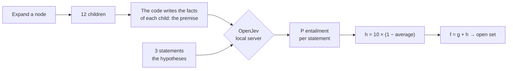

# 🧠 The OpenJev heuristic

🇬🇧 **English** · 🇮🇹 [Italiano](openjev.it.md) · [← README](../README.md)

> **A heuristic that knows nothing about Rubik's Cubes.** Every other heuristic in this app is a formula written
> by a person. This one asks a small language model to *read* the cube and say how solved it looks.

[OpenJev](https://huggingface.co/AlexWortega/openjev) is a 0.8-billion-parameter NLI model (*Natural Language
Inference*) built on Qwen3.5. Give it a **premise** and a **hypothesis** and it answers with three probabilities:
contradiction, entailment, neutral. It does not generate text and it never saw a cube during training. It is the
same model behind [JevMate](https://github.com/sangelastro/JevMate), where it picks chess moves.

## How it plugs into A\*

A\* needs `h(n)`, an estimate of the moves left. With OpenJev, `h` comes from the model's judgement:



1. **The code describes the cube.** Only facts, never opinions:
   > Solved cubies: 7 of 20 (2 of 8 corners, 5 of 12 edges). Cubies in the right place but twisted or flipped: 1.
   > Complete faces: 0 of 6. Stickers on their own face: 34 of 54.
2. **OpenJev judges three statements**, a small ladder from easy to hard:
   - *"At least half of the cubies are solved."*
   - *"Most of the cube is solved."*
   - *"The cube is solved."*
3. **`h = 10 × (1 − average entailment)`**: the more the facts support the statements, the closer to solved the
   cube looks, the lower `h` is. A solved cube gets `h = 0`.

All 12 children of a node are scored in **one call** to the local server (12 × 3 = 36 premise/hypothesis pairs).

### Why these three statements

They were chosen by measurement, not by taste: for 70 cubes scrambled 1 to 8 moves, each candidate wording was
compared with the real scramble depth (Spearman correlation, the closer to −1 the better).

| Statement | Correlation with depth |
|---|---|
| "At least half of the cubies are solved." | **−0.71** |
| "Most of the cube is solved." | **−0.62** |
| "The cube is solved." | **−0.40** |
| "The cube is close to being solved." | +0.56 (wrong direction) |
| "The cube is nearly solved." | −0.01 (flat) |
| "The cube needs only a few more moves to be solved." | +0.31 (wrong direction) |

Vague wordings stay flat: the model needs a statement it can check against the facts.

> **Facts describe, they never judge.** An early version added summaries such as "most cubies are out of place"
> to the premise. The model simply copied them and ignored the numbers. Judging is the model's job; the code only
> reports what is there.

## See what it decided: the "Why?" panel

When OpenJev is the active heuristic, the **Current Decision Analysis** panel shows, for every node A\* expands,
what the model read and how it judged it:

<p align="center">
  
</p>

This example also shows the model's main weakness, honestly: with **1 solved cubie out of 20**, it still agrees
94% with *"at least half of the cubies are solved"*. A 0.8B model reads numbers poorly. Most of the useful signal
comes from the third statement, which varies between roughly 0.35 and 0.75.

## Results

`node bench/race.mjs 5 3 150`: the same 5 seeded cubes, scrambled 3 moves, for every heuristic (laptop, RTX 3060).

| Heuristic | Solved | Avg nodes expanded | Avg solution | Avg time |
|---|---|---|---|---|
| 3D Manhattan | 5/5 | 4 | 3.0 | < 1 ms |
| Single PDB / Disjoint PDB | 5/5 | 4 | 3.0 | 1 ms |
| Misplaced Stickers | 5/5 | 5 | 3.0 | < 1 ms |
| Misplaced Cubies | 5/5 | 11 | 3.0 | 2 ms |
| **🧠 OpenJev** | **5/5** | **18** | **3.0 (optimal)** | **13 s** |
| Twist & Flip | 4/5 | 116 | 3.0 | 17 ms |

A model that has never seen a cube, reading four numbers, needs about 4× the nodes of the hand-written formulas but
beats *Twist & Flip* by a wide margin and always finds the optimal solution on these cubes. It is also about
10,000× slower per node: each expansion is a round trip to a neural network (~0.75 s per batch of 36 pairs).

## Limits

- **It reads numbers poorly.** The first two statements are almost always above 90%, so `h` is squeezed into a
  narrow band (about 1 to 2.5). A\* then behaves close to a breadth-first search, with OpenJev mostly deciding the
  order *within* each depth.
- **It is slow.** About 1–2 seconds per expansion on a laptop GPU (RTX 3060, 6 GB): Qwen3.5's linear-attention
  layers fall back to a pure-PyTorch implementation without the optimised CUDA kernels. The Heuristic Race caps
  OpenJev at 300 expansions.
- **It is not admissible**, so solutions are not guaranteed to be optimal.
- **It needs a local server.** The model is too big to ship to every visitor of the live demo.

## Run it locally

You need Python 3.10+ and, ideally, an NVIDIA GPU (it also runs on CPU, much slower).

```bash
python -m venv .venv
# install torch first, picking the build for your GPU: https://pytorch.org/get-started/locally/
.venv/Scripts/python -m pip install -r openjev/requirements.txt     # on Linux/macOS: .venv/bin/python
.venv/Scripts/python openjev/download_model.py                      # ~1.7 GB, once
.venv/Scripts/python openjev/server.py                              # http://127.0.0.1:7474
```

Then `npm run dev`, pick **OpenJev language model** in the heuristic menu and solve a short scramble (2–4 moves).
The server only listens on `127.0.0.1`. The live demo on GitHub Pages also tries to reach it, so with the server
running you can use OpenJev there too, if your browser allows a public page to call `localhost`.

To compare it with the other heuristics without a browser:

```bash
node bench/race.mjs 5 3,4 250     # 5 cubes per depth, depths 3 and 4, cap of 250 expansions
```

## Credits

[OpenJev](https://huggingface.co/AlexWortega/openjev) by AlexWortega (MIT), built on
[Qwen3.5](https://huggingface.co/Qwen) by Alibaba.
